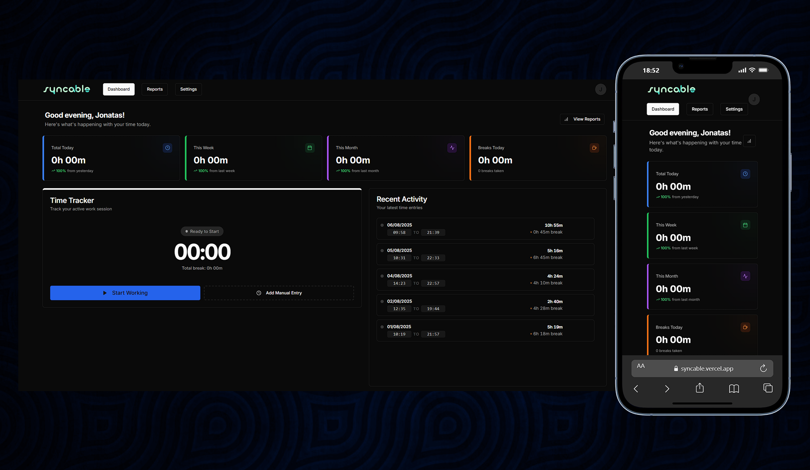
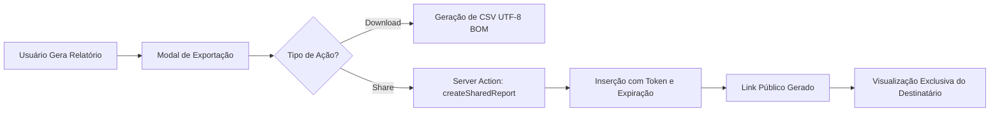

# Syncable - Gestão de Ponto & Payroll Dashboard

Plataforma moderna, intuitiva e responsiva desenvolvida com **Next.js 15**, focada na gestão completa de ponto eletrônico, controle de jornadas, pausas e geração de relatórios detalhados para profissionais e empresas.

<h1 align="center">
  
</h1>

## 🚀 Funcionalidades e Módulos Atualizados

- 🌓 **Interface Premium Elevada:** Design moderno com suporte nativo a temas Claro/Escuro via Tailwind CSS e micro-animações para feedback de usuário.
- ⏱️ **Registro de Ponto Inteligente:** Dashboard interativo para registro instantâneo de entrada, saída e controle de intervalos com cronômetro reativo.
- 🕒 **Ajuste de Jornada Retroativo:**
  - **Entrada Atrasada:** Permite ao usuário ajustar o horário de início caso tenha esquecido de bater o ponto ao chegar.
  - **Saída Atrasada:** Opção de informar o horário real de encerramento no momento da finalização da jornada.
- 📊 **Estatísticas de Alta Fidelidade:** Cards premium com métricas consolidadas (Total Trabalhado, Pausas, Combinado) e gráficos dinâmicos com **Recharts**.
- 📄 **Workflow de Relatórios Premium:**
  - **Geração via Modal:** Interface focada que substitui formulários estáticos por um fluxo intuitivo de geração.
  - **Atalhos Rápidos:** Botões para seleção instantânea de logs Diários, Semanais ou Mensais.
  - **Filtros Dinâmicos:** Escolha entre Visão Resumida, Detalhada ou Apenas Entradas.
  - **Personalização de Identidade:** Opção de incluir **Nome** e **CPF/CNPJ** nos relatórios (Web e CSV) para fins contábeis e profissionais.
- 🖋️ **Observações em Rich Text:**
  - Suporte total a **Slate.js** para anotações formatadas em cada registro de ponto.
  - **Mini Relatórios Diários:** Visualização expansível em tabela para leitura detalhada de atividades sem poluir o layout principal.
  - **Edição Retroativa:** Capacidade de atualizar observações mesmo após o fechamento da jornada.
- 🔗 **Compartilhamento Blindado:**
  - Geração de links públicos anônimos com **tokens criptografados** e expiração customizada.
  - Controle de Auditoria: Opção de habilitar/desabilitar exibição de insights de performance para terceiros.
- 📥 **Exportação de Dados Otimizada:**
  - **Excel/CSV Master:** Arquivo formatado com separadores de sessão, banners personalizados, dados de identificação opcionais e suporte total a UTF-8 BOM.
  - **PDF Digital (Beta):** Visualização de impressão estruturada e otimizada.

## 🏗️ Estrutura do Projeto

```txt
app/
├── (auth)/                         # Fluxos de autenticação (Login e Registro)
├── dashboard/                      # Métricas premium e widget de tracker
├── reports/                        # Módulo de geração e exportação (Novo Modal Workflow)
├── shared-report/                  # Visualização pública anônima dinâmica
├── actions/                        # Core de negócios (Server Actions)
│   ├── time-entries.ts             # Lógica de punch-in/out e intervalos
│   ├── reports.ts                  # Engine de processamento e segurança de links
│   └── dashboard-summary.ts        # Agregador de métricas premium
├── components/                     # Componentes de interface (UI & UX)
│   ├── time-tracker.tsx            # Widget interativo com cronômetro
│   ├── report-insights.tsx         # Cards de produtividade e benchmarks
│   └── ui/                         # Base atômica Shadcn UI + Radix
```

## 🧠 Arquitetura e Decisões de Design

### Sincronização e Performance

O **Syncable** utiliza **Next.js Server Actions** para interagir diretamente com o banco de dados **Neon Serverless (PostgreSQL)**.

- **Cold Starts Zero:** Resposta instantânea graças ao driver `@neondatabase/serverless`.
- **Relatórios On-the-fly:** O processamento de dados para exportação ocorre em tempo de execução, garantindo que o CSV reflita o estado exato do banco.

### Fluxo de Geração de Relatórios (Shared Link)



### Segurança e Privacidade

Cada link de compartilhamento é protegido por um **UUID único** e pode ser configurado com:

1. **Duração Limitada:** Expiração automática em 1, 7, 30 ou 90 dias.
2. **Toggle de Insights:** O usuário decide se o destinatário verá as análises de produtividade ou apenas a tabela de horas bruta.

## 🛠️ Tecnologias Utilizadas

<div align="center">
  
  
  
  
  
  
  
  
  
  
</div>

## 📅 Histórico de Versões

Acompanhe a evolução do **Syncable** em nosso documento oficial de lançamentos.

👉 **[Ver Histórico Completo em RELEASES.md](./RELEASES.md)**

---

## 👨‍💻 Desenvolvedor

| Foto                                                                                                                             | Nome                                                 | Cargo                                      |
| :------------------------------------------------------------------------------------------------------------------------------- | :--------------------------------------------------- | :----------------------------------------- |
|  | [Jonatas Silva](https://github.com/JsCodeDevlopment) | Senior Software Engineer / CTO & Tech Lead |

## 📄 Licença

Este projeto é privado e de uso restrito da **Syncable Corporation**.

---

<div align="center">
  <sub>Built with ❤️ by <a href="https://github.com/JsCodeDevlopment">Jonatas Silva</a></sub>
</div>
