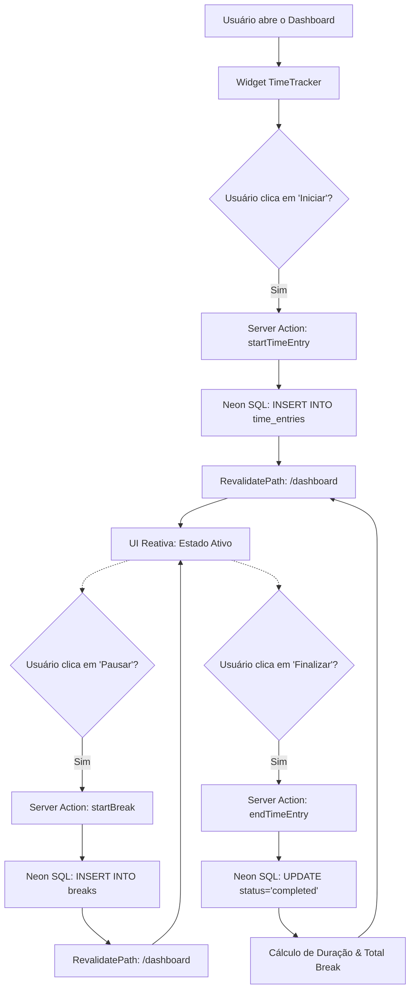

# Syncable - Gestão de Ponto & Payroll Dashboard

Plataforma moderna, intuitiva e responsiva desenvolvida com **Next.js 15**, focada na gestão completa de ponto eletrônico, controle de jornadas, pausas e geração de relatórios detalhados para profissionais e empresas.

<h1 align="center">
  
</h1>

## Funcionalidades e Módulos

- 🌓 **Interface Premium:** Design moderno com suporte nativo a temas Claro/Escuro via Tailwind CSS.
- ⏱️ **Registro de Ponto em Tempo Real:** Dashboard interativo para registro instantâneo de entrada, saída e controle de intervalos (pausas).
- 📊 **Estatísticas Avançadas:** Visualização dinâmica de horas trabalhadas, médias semanais e mensais através de gráficos interativos com **Recharts**.
- 📂 **Gestão de Entradas Manuais:** Flexibilidade para adicionar, editar ou excluir registros históricos, facilitando correções retroativas.
- 📄 **Relatórios Inteligentes:** Geração de relatórios com filtros por período e visualização detalhada de jornadas, breaks e horas líquidas.
- 🔗 **Compartilhamento Seguro:** Sistema de links públicos temporários (Shared Reports) protegidos por tokens únicos, permitindo o compartilhamento seguro com gestores.
- ⚙️ **Configurações de Conta:** Gestão de perfil, preferências de exibição de tempo e segurança integrada.
- 📱 **Mobile First:** Experiência totalmente adaptativa, garantindo produtividade tanto no Desktop quanto em dispositivos móveis.

## Estrutura do Projeto

```txt
app/
├── (auth)/                         # Fluxos de autenticação (Login e Registro)
├── dashboard/                      # O coração da plataforma: métricas e tracker
├── reports/                        # Módulo de filtragem e geração de relatórios
├── shared-report/                  # Visualização pública anônima via tokens
├── settings/                       # Painel de controle do usuário e preferências
├── actions/                        # Core de negócios (Server Actions)
│   ├── time-entries.ts             # Lógica de punch-in/out e intervalos
│   ├── reports.ts                  # Engine de processamento de dados para relatórios
│   ├── dashboard-summary.ts        # Agregador de métricas para o dashboard
│   └── user-settings.ts            # Gestão de preferências e perfil
├── components/                     # Componentes de interface (UI & UX)
│   ├── time-tracker.tsx            # Widget interativo de controle de ponto
│   ├── recent-entries.tsx          # Feed de atividades recentes
│   ├── stats/                      # Gráficos e módulos de estatísticas
│   └── ui/                         # Base atômica Shadcn UI + Radix
├── lib/                            # Utilitários, hooks e configuração de DB
└── public/                         # Ativos estáticos e capturas de tela
```

## Arquitetura e Decisões de Design

### Sincronização em Tempo Real (Server Actions & Neon)

Diferente de arquiteturas que utilizam APIs REST ou GraphQL tradicionais, o **Syncable** utiliza o poder do **Next.js Server Actions** para interagir diretamente com o banco de dados **Neon Serverless (PostgreSQL) através do driver `@neondatabase/serverless`**.
Isso elimina o overhead de rede e garante que a lógica de negócio esteja sempre próxima aos dados, enquanto o TypeScript assegura a integridade dos dados de ponta a ponta.

### Fluxo de Trabalho do Time Tracker

Abaixo está o fluxo simplificado de como o sistema gerencia as jornadas de trabalho:



### Por Que Neon Serverless (Raw SQL)?

Decidimos utilizar o driver sem servidor do **Neon** com consultas SQL puras (raw queries) em vez de um ORM pesado (como Prisma ou TypeORM). Isso resulta em:

1. **Cold Starts Zero:** Resposta instantânea nas Server Actions.
2. **Consultas Otimizadas:** Controle granular sobre agregações complexas de tempo e horas.
3. **Leveza:** Redução drástica no tamanho final do pacote servido pelo Next.js.

## Tecnologias Utilizadas

<div align="center">
  
  
  
  
  
  
  
  
  
  
</div>

> Tecnologias-chave: SSR com React 19 / Next.js 15, Neon Serverless, Recharts, Shadcn UI, Zustand para estado leve e Zod para validação.

## Desenvolvedor

| Foto                                                                                                                             | Nome                                                 | Cargo                                      |
| :------------------------------------------------------------------------------------------------------------------------------- | :--------------------------------------------------- | :----------------------------------------- |
|  | [Jonatas Silva](https://github.com/JsCodeDevlopment) | Senior Software Engineer / CTO & Tech Lead |

## Licença

Este projeto é privado e de uso restrito da **Syncable Corporation**.

---

<div align="center">
  <sub>Built with ❤️ by <a href="https://github.com/JsCodeDevlopment">Jonatas Silva</a></sub>
</div>
